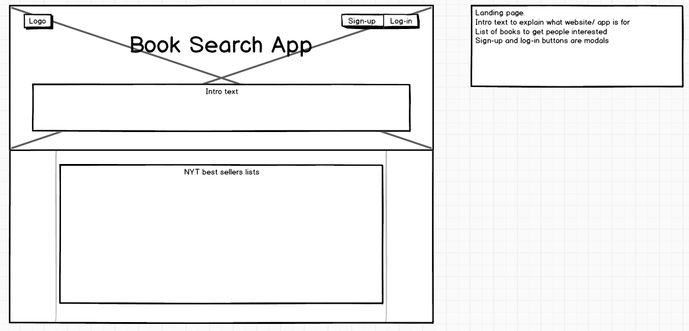
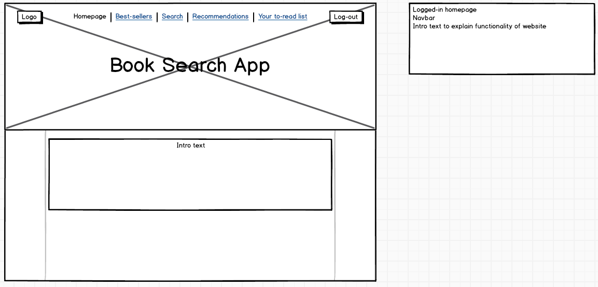
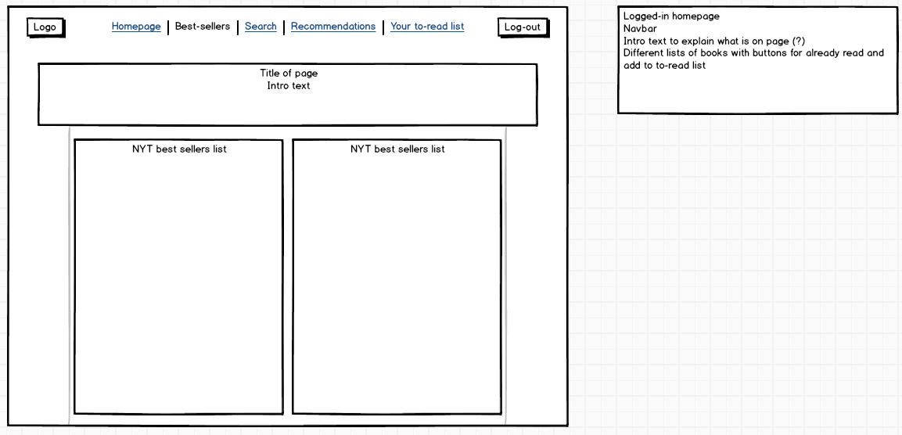
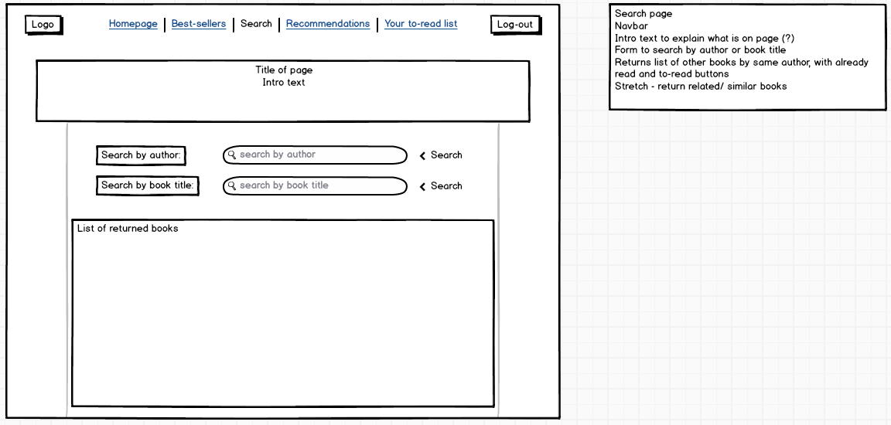
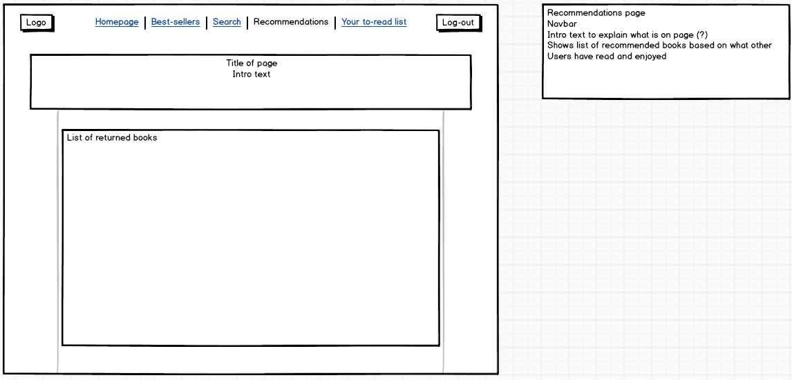
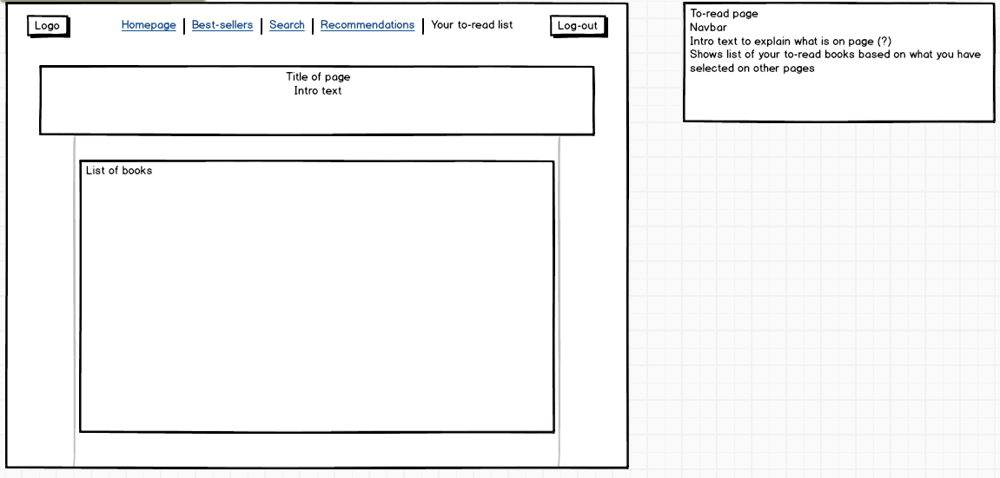

<strong>NEXT BOOK</strong>

Built 22nd - 29th October 2015

First full app built after 4 weeks of coding.

Next Book is an app for book lovers to help them find their next books.
It provides lists of the latest best-sellers and has a search engine based on author
name or book title. Recommendations are provided based on books that users
have read and enjoyed. A personal to-read list helps users keep track of books
that they would like to read in the future.

You can view Next Book on [Heroku](https://next-book.herokuapp.com).

User Stories:
- My name is Natasha and I always struggle to choose a new book once I have finished
reading one. I want the ability to find good books quickly and easily.
- My name is Lesley and I want the ability to search for books by authors I like.
- My name is Chris and I read really fast. I want to find more books quickly,
which I know I'll enjoy because other people who have read the same books as me
have also read and enjoyed them.
- My name is Edd and I like lists. I want to have a list of books that I want
to read in the future.

APIs used:
- [New York Times Best Sellers API](http://developer.nytimes.com/docs/best_sellers_api)
- [Google Books API](https://developers.google.com/books/docs/overview)

Libraries used:
- Languages: HTML5, CSS3, Javascript
- Front-end: JQuery, JQuery validate, Ajax, Bootstrap, Google Fonts
- Back-end: Node.js, Express, Bcrypt, Body-parser, Cookie-parser, Ejs, Express-session, Request, Nodemailer, Dotenv
- Database: MongoDB with Mongoose

Wishlist / Future Development:
- Fine tuning of the recommendations function
- Further error handling/ testing
- Further work on Google books API - enhance search function either through fine-tuning
or use of another API
- Work on add to list and read and enjoyed buttons so don't stay grey
- Be able to recommend books to other users

Wireframes:

